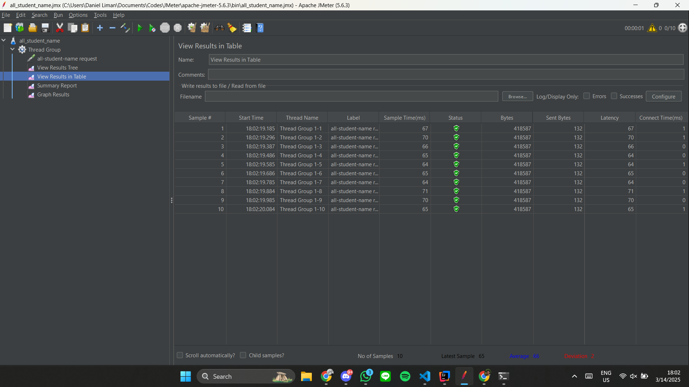
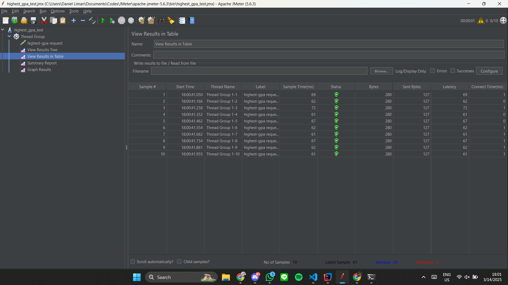
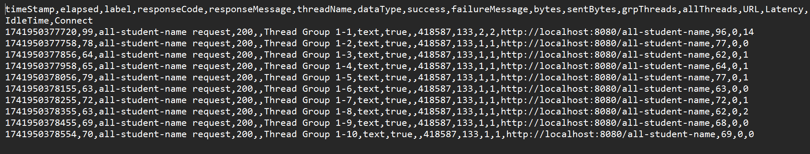
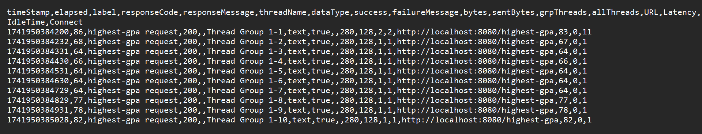

## Before Optimizing

### JMeter GUI Test Result

### JTL Report

## After Optimizing

### JMeter GUI Test Result

### JTL Report

### Kesimpulan

Pada hasil dari testing yang saya lakukan dengan JMeter, dapat terlihat bahwa perbedaan waktu menjadi sangat menurun, bahkan lebih dari 20%. Contohnya, pada test di endpoint `/all-student-name`, yang terjadi perubahan dari waktu awal sebesar 10121 menjadi hanya 67 saja. Walaupun begitu, tidak terjadi perubahan yang terlalu signifikan di `/highest-gpa`, namun masih ada perubahan kecil ayng tercatat pada hasil setelah dilakukannya refactoring pada kode.

## Reflection

1. What is the difference between the approach of performance testing with JMeter and profiling with IntelliJ Profiler in the context of optimizing application performance?

    Performance testing dengan JMeter dan profiling dengan IntelliJ Profiler memiliki perbedaan dalam konteks optimasi performa aplikasi, di mana JMeter lebih fokus pada simulasi beban dan uji ketahanan aplikasi dengan meniru trafik pengguna secara masif, sedangkan IntelliJ Profiler memberikan analisis mendalam mengenai penggunaan sumber daya internal seperti CPU, memori, dan *thread*. Saat menggunakan JMeter, saya dapat mengukur respon aplikasi terhadap tekanan eksternal dan mengidentifikasi masalah skalabilitas, sementara IntelliJ Profiler membantu dalam mengungkap detail alur eksekusi yang menyebabkan kemacetan dan potensi *memory leaks*.

2. How does the profiling process help you in identifying and understanding the weak points in your application?

    Proses profiling sangat membantu saya sebagai developer dalam mengidentifikasi dan memahami titik lemah pada aplikasi karena alat seperti IntelliJ Profiler mampu memeriksa secara *real-time* penggunaan *resource* dan eksekusi kode pada proyek saya. Melalui data visualisasi seperti grafik CPU dan alokasi dari memori, saya dapat dengan cepat menemukan fungsi atau metode yang bermasalah serta menganalisis bagaimana interaksi antar komponen aplikasi mempengaruhi performa keseluruhan.

3. Do you think IntelliJ Profiler is effective in assisting you to analyze and identify bottlenecks in your application code?

    Menurut saya, IntelliJ Profiler cukup efektif dalam membantu saya untuk bisa menganalisis dan mengidentifikasi *bottlenecks* pada kode di proyek ini, karena Intellij Profiler dapat menyediakan tampilan yang lengkap dan fitur-fitur analisis yang mendalam sehingga memungkinkan saya mengevaluasi setiap performa dari komponen-komponen yang terlibat dalam menjalankan aplikasi web ini. Intellij Profiler juga membuat proses debugging menjadi lebih cepat, karena setiap perubahan kode dapat segera diuji dampaknya dalam performa yang didapatkan.

4. What are the main challenges you face when conducting performance testing and profiling, and how do you overcome these challenges?

    Saya merasa jika tantangan utama yang sering saya hadapi dalam performance testing terdapat di saat saya harus mereplikasi kondisi environment production yang diperlukan pada saat profiling. Untuk mengatasi tantangan tersebut, saya memakai kombinasi dengan JMeter untuk menguji workload di dalam skenario yang aslinya, serta melakukan validasi ulang dengan IntelliJ Profiler. Dengan pengujian yang dikombinasikan tersebut, saya menjadi lebih yakin bahwa hasil testing yang diperoleh benar-benar mencerminkan performa aplikasi dan dapat digunakan sebagai bahan untuk refactoring.

5. What are the main benefits you gain from using IntelliJ Profiler for profiling your application code?

    Penggunaan IntelliJ Profiler pada proses testing di proyek ini terdapat pada mudahnya memperoleh data analisis yang detail mengenai penggunaan CPU, memori, dan thread yang juga membantu saya untuk mengidentifikasi bagian-bagian yang perlu diperhatikan di dalam proyek ini. Fitur visualisasi yang disediakan oleh Intellij Profiler memudahkan saya pula dalam pemantauan secara real-time, sehingga potensi *bottleneck* yang ada dapat segera diketahui oleh saya dan ditangani sebelum berdampak pada performa proyek secara keseluruhan.

6. How do you handle situations where the results from profiling with IntelliJ Profiler are not entirely consistent with findings from performance testing using JMeter?

    Saat hasil profiling dengan IntelliJ Profiler, saya masih belum mendapatkan kasus dimana kedua tools tersebut memiliki hasil yang bertolak belakang. Namun, jika suatu saat hasil yang saya dapatkan tidak sepenuhnya konsisten dengan hasil dari performance testing menggunakan JMeter, saya akan mengatasi situasi ini dengan melakukan cross-validation antara kedua metode pengujian. Dengan melakukan pendekatan ini, saya dapat mengidentifikasi dan memahami sumber dari perbedaan yang bisa saja muncul antara hasil yang diperoleh dari kedua tools dan menentukan bagian mana yang menyebabkan masalah tersebut, sehingga saya bisa mengoptimalkan hasil dari testing saya dan untuk testing-testing kedepannya.

7. What strategies do you implement in optimizing application code after analyzing results from performance testing and profiling? How do you ensure the changes you make do not affect the application's functionality?

    Strategi yang saya akan implementasikan dimulai dengan melakukan pengujian menggunakan JMeter dan analisis performa melalui IntelliJ Profiler terlebih dahulu. Setelah mendapatkan inspirasi dan masalah yang ditemukan pada testing dari kedua tools tersebut, saya selanjutnya akan fokus dalam mengoptimasi kode di proyek saya berdasarkan kompleksitas, penggunaan memori, dan efektivitas algoritma yang dipakai. Kemudian, barulah saya akan melakukan pengujian ulang untuk memastikan adanya peningkatan performa sesuai yang diharapkan setelah optimisasi kode tersebut.